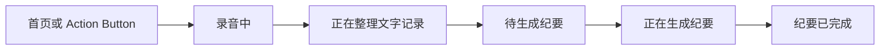
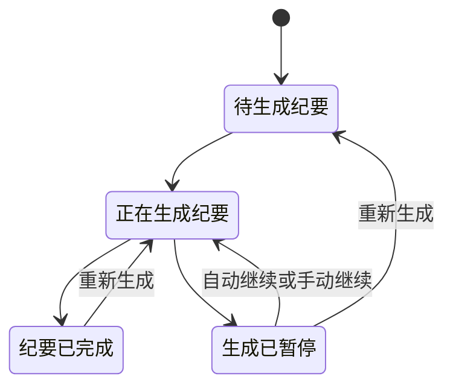

# Quillvault MVP 产品规格

> 状态：已确认，实施中
> 日期：2026-07-30
> 目标：可通过 TestFlight 分发、可长期演进的首个产品版本

## 1. 版本定位

MVP 是依据真机技术闭环 Demo 的验证结论重新建设的正式产品工程。Demo 只提供技术证据、测试样本和失败经验，不复用其工程结构，也不以渐进重构方式将 Demo 变为 MVP。

MVP 面向 PKM 技术用户，完成从快速录音、设备端转写、异步 BYOK 纪要到 Markdown 会议资产管理的完整链路，并能够承担高频、长时间的真实会议工作。

### 1.1 成功定义

- 核心链路完整，可交付内测用户长期使用；
- 录音、文字记录和已发布纪要不存在已知不可逆损坏路径；
- 文字记录一旦就绪，纪要最终可通过继续或重新生成获得；
- 生成期间允许进入后台、锁屏、进程终止和网络波动；
- 2,000 场历史会议规模下，浏览、搜索和查看仍然可用；
- UI 简洁、清晰、符合 iOS 交互习惯，实用与效率优先。

## 2. 范围

### 2.1 MVP 包含

- 首页一次主操作开始面对面会话；
- Action Button 通过 App Shortcut 快速开始；
- 后台和锁屏持续录音；
- SpeechAnalyzer/SpeechTranscriber 设备端转写；
- 录音中断后的资产恢复、继续或结束整理；
- 历史会议列表、本地全文搜索和筛选；
- 查看总结、图示、文字记录；
- 播放、暂停、拖动录音，并从文字记录时间定位音频；
- 多个 OpenAI-compatible 模型配置；
- 选择当前模型配置；
- 文字记录就绪后自动或手动进入纪要生成；
- 异步、后台、可检查点恢复的纪要生成；
- 进度百分比和具体阶段反馈；
- 自动继续、手动继续和重新生成；
- 首次使用时通过系统文件夹选择器授权外部权威目录；
- 权威目录可位于 iCloud Drive、Obsidian Vault、本机或其他 Files Provider；
- Markdown、音频与 Mermaid 会议资产；
- 本地脱敏诊断与用户主动导出。

### 2.2 MVP 不包含

- Apple Foundation Models 设备端纪要；
- 导入已有音频；
- StoreKit 付费；
- 非 OpenAI-compatible 专有协议适配器；
- 说话人分离、声纹或身份猜测；
- 视频、在线会议机器人或其他 App 系统音频；
- 团队、账号、云端协作或 Quillvault 服务端；
- 语义搜索、向量数据库或跨会议 AI 问答；
- 完整的内置 Markdown/文字记录编辑器；
- Siri、锁屏组件、Apple Watch 等额外启动入口。
- 应用自有的默认 iCloud Drive 目录与 iCloud 容器。

## 3. 产品信息架构

MVP 使用三个一级入口：

1. **首页**：开始录音、正在录音、待恢复会议、生成中任务和最近会议；
2. **纪要**：历史列表、搜索、筛选和会议详情；
3. **设置**：模型配置、当前模型、自动生成、权威目录、录音、隐私和诊断。

录音页采用专注的全屏流程。会议详情统一承载总结、图示、文字记录和录音，不把同一会议拆成多个一级页面。BYOK 不占用独立 Tab。

## 4. 核心用户流程

### 4.1 正常流程



1. 首次使用时，用户通过系统文件夹选择器授权外部权威目录；
2. 用户从首页或 Action Button 启动面对面会话；
3. App 立即开始录音，并在前台显示实时文字记录；
4. 用户结束录音后，App 从原始录音补齐并原子写入完整文字记录；
5. 会议进入“待生成纪要”；
6. 自动生成开启且模型可用时进入队列，否则等待用户手动生成；
7. 用户可以离开生成页，继续查看文字记录或播放录音；
8. 纪要成功原子写入后显示“纪要已完成”。

### 4.2 录音中断

- 来电或音频路由变化等短暂中断，条件允许时自动恢复；
- 时间轴明确记录中断范围，不伪装成连续音频；
- App 终止后，下次启动找回可播放的已有录音；
- 用户选择“继续本次会议”或“结束并整理”；
- Action Button 遇到待处理的中断会议时，不得静默覆盖。

### 4.3 纪要生成中断



- 模型异常、网络中断、系统终止和 App 退出都不得成为不可恢复终态；
- 每个确定性工作单元完成后持久化检查点；
- 自动继续和手动继续沿用任务创建时的模型配置与文字记录版本；
- 重新生成创建新一代任务，可选择其他模型；
- 同一会议最多一个活跃生成任务；
- 新纪要成功前，旧纪要保持可读；
- 如果旧 `minutes.md` 被外部修改，替换前必须获得用户确认。

## 5. 功能要求

### 5.1 首页与快速录音

- 首页首要视觉和交互元素是“开始录音”；
- 首次录音前完成权威目录授权、权限、录音告知和存储空间检查；
- 点击后立即进入明确的录音状态，不能先等待 AI 或网络；
- 录音页显示时长、录音状态、音频中断、实时文字记录和结束操作；
- 录音开始、暂停/中断和结束必须有 VoiceOver 可读反馈；
- Action Button 使用同一录音用例，不维护第二套业务流程。

### 5.2 转写

- 原始录音是转写的可追溯输入；
- 前台显示 volatile 与 final 结果，但只将 final 结果写入最终文字记录；
- 后台无法持续分析时，恢复前台或结束后从录音追平；
- 去重、重叠处理和时间范围规范化必须确定；
- “文字记录已就绪”只表示完整文字记录已经原子写入权威目录；
- 已就绪文字记录是纪要任务的不可变版本输入。

### 5.3 纪要管理

- 默认按最近时间排序；
- 支持按标题、摘要和文字记录正文进行设备端全文搜索；
- 支持按日期、纪要状态和模型配置筛选；
- 会议卡片展示标题、时间、时长、状态和模型；
- 详情页支持总结、图示、文字记录和录音四类内容；
- 文字记录时间范围可定位录音播放位置；
- 外部修改 Markdown 后，索引应最终重新同步；
- 索引丢失时可从权威目录重建。

### 5.4 纪要生成

#### 任务绑定

- 任务绑定模型配置快照和文字记录内容版本；
- 快照包含 Base URL、模型名和生成参数，不复制 API Key；
- API Key 通过 Keychain 凭据引用读取；
- 当前模型配置变化不得改变正在继续的任务；
- 删除被未完成任务使用的模型配置前必须提示。

#### 后台执行

- 用户触发后创建 `BGContinuedProcessingTask`；
- App 与系统 Live Activity 均显示进度；
- 系统可以终止任务，因此持久检查点是正确性要求而非优化；
- 用户从多任务界面强制关闭 App 后，不承诺系统立即重启任务；
- 下次可运行时自动检查待恢复任务；
- 用户随时可以手动继续或重新生成。

#### 进度

进度代表确定性工作量，不代表剩余时间：

| 阶段 | 权重 |
| --- | ---: |
| 分段摘要 | 70% |
| 合并结构化纪要 | 20% |
| 校验、规范化与图示 | 5% |
| 原子写入并确认 | 5% |

- 根据实际分段数量分配阶段权重；
- 同时显示“正在总结第 3/8 段”等具体说明；
- 恢复后从已完成检查点继续，百分比不得倒退；
- `minutes.md` 成功写入前最高为 99%，确认后才显示 100%。

#### 输出容错

- 有非空、可读且安全的有效正文时即可发布；
- 次要字段、时间范围和图关系尽量本地规范化；
- 无法形成完整结构时仍展示可用 Markdown/文本；
- Mermaid 失败不阻塞文字纪要；
- 缺失内容通过“信息可能不完整”提示表达，不增加“部分完成”状态；
- 空响应、无意义垃圾内容或安全违规才拒绝发布；
- 用户不满意时可以重新生成。

### 5.5 BYOK 与模型配置

- 用户可创建、命名、测试、编辑和删除多个模型配置；
- MVP 只交付 OpenAI-compatible Chat Completions 适配器；
- 模型配置保存用户填写的完整 HTTPS 接口地址，路径由用户决定；App 不校验固定路径，也不自动拼接路径；
- 业务层通过 `AIProvider` 边界与具体协议隔离；
- 连接测试必须发送真实、最小化模型请求，验证代表性输出能力；
- HTTP 200 不等于模型兼容；
- 当前模型用于新任务，旧任务继续使用创建时快照；
- 首次启用自动生成时明确披露文字记录会发送到目标域名并可能产生费用；
- API Key 使用 `kSecAttrAccessibleAfterFirstUnlockThisDeviceOnly`，不迁移到其他设备；
- 设备重启后未首次解锁时，后台任务保持“生成已暂停”。

### 5.6 文件与外部修改

会议资产仍采用：

```text
meeting-<timestamp>/
├── recording.m4a
├── transcript.md
└── minutes.md
```

- 文件是内容真相，数据库不能成为唯一内容源；
- 文件写入使用同目录临时文件、同步、协调和原子替换；
- 生成失败不得留下残缺 `minutes.md`；
- 任务开始时绑定文字记录内容指纹；
- 文字记录被外部修改后，现有纪要标记“纪要已过期”；
- 基于旧文字记录生成的结果仍可查看，但不能冒充最新；
- 重新生成基于最新文字记录创建新任务。

### 5.7 本地诊断

- 记录流水线阶段、耗时、重试、任务恢复、请求规模和 HTTP 分类；
- 记录 DNS、连接、TLS、首字节、下载结束等 URLSession 指标；
- 记录模型名和服务域名，不记录文字记录、纪要正文、API Key 或认证 Header；
- 本地循环保存最多 14 天或达到容量上限；
- 用户从设置页预览并主动导出；
- App 不自动上传诊断、崩溃或使用数据。

## 6. 用户状态语言

用户可见状态限定为：

- 录音中
- 录音已中断
- 正在整理文字记录
- 待生成纪要
- 正在生成纪要
- 生成已暂停
- 纪要已完成
- 纪要已过期

“失败”只描述某次技术尝试，不作为会议终态。

## 7. 负载目标

- 单场会议最长 3 小时；
- 每天最多 10 场、累计录音 8 小时的正常工作负载；
- 至少 2,000 场历史会议仍可正常浏览、搜索和查看；
- 至少 20 份待生成纪要可以排队；
- 同一时间只执行一个纪要任务；
- 新录音优先级高于纪要生成；
- 资源紧张时，在检查点安全暂停生成，录音结束后自动继续。

## 8. UI 原则

- 使用系统排版、SF Symbols、动态字体和标准交互作为基础；
- 建立小而一致的 Design System，不依赖通用第三方 UI 框架；
- 重要状态同时使用文字、图标和颜色，不只依赖颜色；
- 高风险操作明确确认，常用操作减少层级；
- 列表和详情优先保证信息密度、扫描效率与可访问性；
- AI 生成资源只用于品牌或空状态插图，不进入关键操作和状态表达；
- 支持浅色、深色、放大字体、减少动态效果和 VoiceOver。

## 9. 与后续 v1 的关系

MVP 验证长期产品工程和核心使用闭环。设备端纪要、音频导入、StoreKit 等能力仍保留为后续里程碑，不应在 MVP 内留下阻碍扩展的硬编码，但也不为未交付能力提前建设完整实现。

## 10. 验收引用

具体质量、性能、故障注入和真机门槛见：

- [MVP 项目架构规范](./MVP_项目架构规范.md)
- [MVP 依赖调研与选型](./MVP_依赖调研与选型.md)
- [MVP 测试与非功能验收标准](./MVP_测试与非功能验收标准.md)
