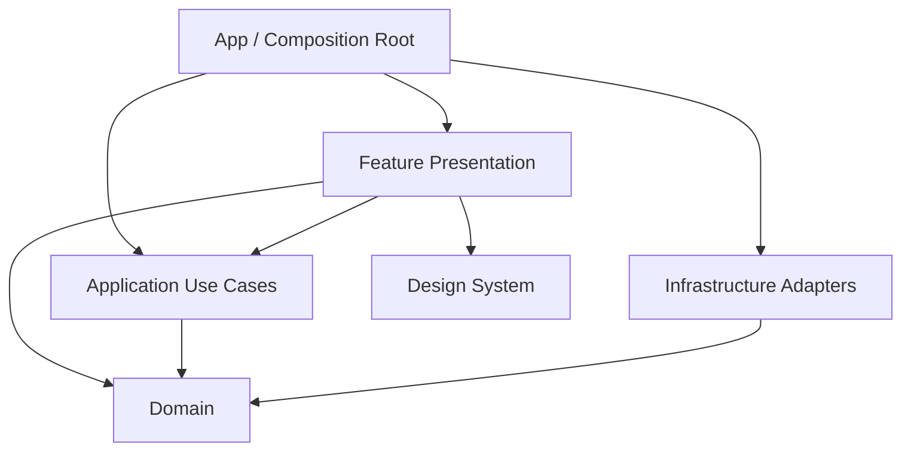
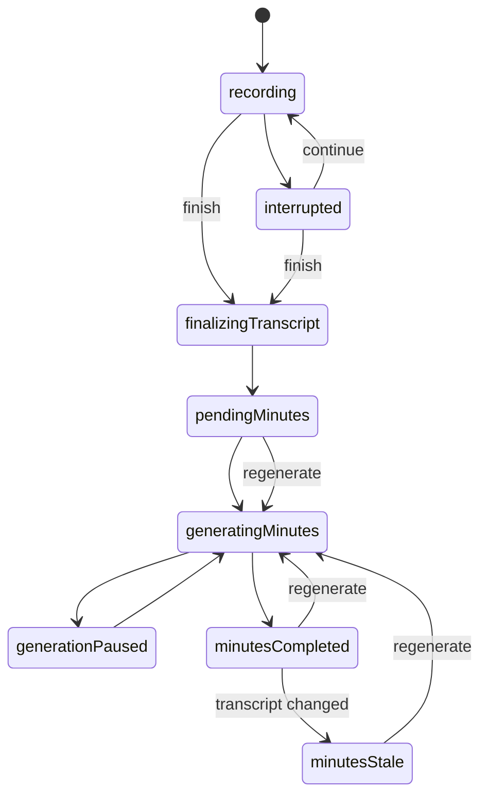

# Quillvault MVP 项目架构规范

> 状态：已确认，实施中
> 日期：2026-07-30
> 适用范围：MVP 及其后续商用版本

## 1. 架构目标

架构首先保障：

1. 录音和文件资产不会被 AI、UI 或数据库故障连带损坏；
2. 长纪要任务跨后台、终止和重启仍可恢复；
3. 每个模块、类型和文件职责聚焦；
4. 业务规则可以脱离 SwiftUI、文件系统和网络进行测试；
5. 后续增加 Provider、设备端纪要或付费能力时，不重写核心领域；
6. 第三方依赖可替换，不成为领域模型的一部分。

## 2. 技术基线

- 最低系统：iOS 26；
- 语言：Swift 6，开启严格并发检查；
- UI：SwiftUI + Observation；
- 并发：Swift Concurrency；
- 模块化：仓库内 Local Swift Packages；
- 数据库：SQLite + GRDB；
- 构建依赖：Swift Package Manager；
- 单一 App Target，按必要性增加测试 Target 和 App Intents 支持；
- 不复用 `QuillvaultDemo` Target、源文件或其工程结构。

Apple 推荐使用本地 Swift Packages 组织可维护模块；Observation 为 SwiftUI 提供原生可观察模型。[Local Packages](https://developer.apple.com/documentation/xcode/organizing-your-code-with-local-packages) · [SwiftUI Model Data](https://developer.apple.com/documentation/swiftui/model-data)

## 3. 架构风格

采用模块化单体和以下依赖方向：



### 3.1 各层职责

**Domain**

- 领域实体、值对象、状态机、错误分类和端口协议；
- 不导入 SwiftUI、GRDB、AVFoundation、Speech、WebKit 或 URLSession；
- 不读取单例，不访问当前时间、随机数或文件系统；
- 规则必须可用纯内存测试。

**Application**

- 编排用例和事务边界；
- 例如开始会议、结束并整理、继续生成、重新生成、重建索引；
- 依赖 Domain 端口，通过注入访问基础设施；
- 不包含具体数据库 SQL、HTTP DTO 或 SwiftUI 状态。

**Infrastructure**

- 实现 Domain 端口；
- 封装 Apple Framework 和第三方库；
- 将外部错误映射为稳定的领域错误；
- 不向上泄漏 GRDB Row、URLSession 响应、AVAudioPCMBuffer 等类型。

**Feature Presentation**

- SwiftUI View、导航、Feature State 和用户 Action；
- 调用 Application 用例并投影领域状态；
- 不直接访问数据库、文件、Keychain、录音或网络；
- 不在 View 中实现业务状态机或重试循环。

**App / Composition Root**

- 创建生产依赖、数据库和后台任务处理器；
- 注册 App Intents 与 BackgroundTasks；
- 建立根导航和生命周期协调；
- 是唯一允许知道具体 Adapter 组合的位置。

**Design System**

- 颜色、排版、间距、组件、图标语义、动画和可访问性；
- 不依赖业务 Feature；
- 不承载业务状态。

## 4. 建议工程结构

```text
Quillvault.xcodeproj
QuillvaultApp/
├── App/
│   ├── QuillvaultApp.swift
│   ├── AppCompositionRoot.swift
│   ├── AppRouter.swift
│   └── AppLifecycleCoordinator.swift
├── Resources/
│   ├── Assets.xcassets
│   ├── Localizable.xcstrings
│   └── PrivacyInfo.xcprivacy
└── SupportingFiles/

Packages/
├── QuillvaultCore/
│   ├── Package.swift
│   └── Sources/
│       ├── Domain/
│       ├── Application/
│       └── TestingSupport/
├── QuillvaultFeatures/
│   ├── Package.swift
│   └── Sources/
│       ├── HomeFeature/
│       ├── RecordingFeature/
│       ├── MeetingsFeature/
│       ├── GenerationFeature/
│       ├── ModelsFeature/
│       └── SettingsFeature/
├── QuillvaultInfrastructure/
│   ├── Package.swift
│   └── Sources/
│       ├── PersistenceGRDB/
│       ├── MeetingFileStore/
│       ├── AudioCapture/
│       ├── SpeechTranscription/
│       ├── AIClient/
│       ├── GenerationRuntime/
│       ├── BackgroundRuntime/
│       ├── SecureStore/
│       ├── Diagnostics/
│       └── MermaidRenderer/
└── QuillvaultDesignSystem/
    ├── Package.swift
    └── Sources/
        └── DesignSystem/

QuillvaultUITests/
QuillvaultAppIntentTests/
```

该结构是边界而非要求为每个目录创建空 Target。初始实现只创建有真实代码的模块；当编译依赖或职责需要隔离时再拆分 Target。

## 5. 模块规则

### 5.1 依赖规则

- `Domain` 不依赖任何项目模块；
- `Application` 只依赖 `Domain`；
- Infrastructure Target 依赖 `Domain`，必要时依赖 Foundation；
- Feature Target 依赖 `Application`、`Domain` 和 `DesignSystem`；
- Feature 之间不得直接互相导入；
- 跨 Feature 导航通过 App Router 或领域标识完成；
- 禁止循环依赖；
- 第三方库只能出现在明确的 Adapter 或测试 Target。

### 5.2 文件职责

- 默认一个主要类型一个文件；
- 文件名与主要类型一致；
- View 只描述布局和轻量展示转换；
- Feature Model 只管理一个 Feature 的 UI 状态和 Action；
- Use Case 只表达一个用户目标；
- Repository/Store 名称必须说明持久对象与边界；
- `Manager`、`Helper`、`Utils`、`Common` 不得作为新类型或目录的默认命名；
- 单文件出现多个不相关变化原因时必须拆分；
- 超过约 300 行作为评审信号，不作为机械硬限制；
- Extension 按协议或职责命名，例如 `Meeting+DisplayTitle.swift`。

### 5.3 API 规则

- 默认 `internal`，跨模块需要时才声明 `public`；
- 公共接口使用领域类型，不暴露基础设施类型；
- 对外异步接口使用 `async throws` 或 `AsyncSequence`；
- 可取消操作必须传播 Swift Task cancellation；
- 时间、UUID、网络状态等不确定输入通过依赖注入；
- 不建立全局 Service Locator。

## 6. 领域模型基线

建议核心聚合和标识：

| 类型 | 责任 |
| --- | --- |
| `Meeting` | 会话身份、时间、语言和用户状态 |
| `RecordingSession` | 录音生命周期、中断与片段 |
| `TranscriptRevision` | 完整文字记录版本、指纹和时间范围 |
| `MinutesRevision` | 已发布纪要、来源版本和完整性提示 |
| `GenerationJob` | 可恢复纪要任务及绑定快照 |
| `GenerationStep` | 确定性工作单元与检查点 |
| `ModelProfile` | 非密钥模型配置 |
| `AuthoritativeDirectory` | 唯一内容根目录授权 |

标识使用稳定 UUID，不以标题、文件名或数据库自增 ID 作为领域身份。文件目录保存稳定 `meeting_id`，索引重建后身份不变。

## 7. 状态机

### 7.1 会议状态

会议状态转换必须由 Domain 状态机执行，UI 不得自由赋值：



某次技术失败通过 `AttemptFailure` 和错误分类记录，不新增不可恢复的 Meeting `failed` 状态。

### 7.2 生成任务

`GenerationJob` 至少包含：

- Job ID、Meeting ID、世代号；
- TranscriptRevision ID 与内容指纹；
- ModelProfile 快照与 Keychain 引用；
- Prompt/Schema 版本；
- 分块计划版本；
- 当前步骤、完成步骤和进度；
- 尝试次数、下次重试时间和暂停原因；
- 创建、开始、更新和完成时间；
- 候选输出位置与最终发布状态。

每个 Step 使用稳定幂等键：

```text
<job-id>/<prompt-version>/<step-kind>/<chunk-index>/<input-hash>
```

恢复时先验证已有检查点的输入指纹和输出完整性；验证通过才跳过，不以“数据库显示成功”作为唯一依据。

## 8. 数据持久化

### 8.1 内容与操作状态分离

**内容真相**

- `recording.m4a`
- `transcript.md`
- `minutes.md`

每个正式会议目录同时包含可见的 `meeting.json` 身份清单，当前
`schemaVersion` 为 `1`，保存稳定 UUID `meetingID` 与 `createdAt`。该清单只定义
文件目录身份，不复制三类内容正文；索引删除后以它恢复同一 Meeting ID。缺少或无法
解析清单、没有任何正式资产，或目录名带 `.candidate`、`.partial`、`.tmp` 后缀时，
扫描器只记录脱敏诊断，不把目录当作有效会议。

**可重建或运行状态**

- 会议列表索引；
- FTS 搜索索引；
- 文件指纹；
- 生成 Job 与 Step；
- 模型配置的非密钥部分；
- 本地诊断事件。

### 8.2 GRDB 表建议

```text
meeting_index
meeting_file_fingerprint
transcript_revision
minutes_revision
generation_job
generation_step
model_profile
diagnostic_event
schema_metadata
```

- 数据库启用 WAL；
- 所有 schema 变化使用有名称、可测试的迁移；
- Job 状态与 Step 检查点在同一事务提交；
- FTS 表从解析后的 Markdown 内容更新；
- 数据库提供完全重建入口；
- 重建期间 UI 可以显示进度并保持已有文件可访问。
- 当前首个命名迁移为 `v1_create_rebuildable_meeting_catalog`；数据库损坏时只隔离
  SQLite、WAL 与 SHM 文件，再由协调只读扫描重建，绝不修改权威会议文件。

## 9. 文件系统规范

- 权威目录访问集中在 `MeetingFileStore` Actor；
- MVP 不申请应用自有 iCloud 容器；首次使用必须通过系统文件夹选择器获得
  外部目录授权，没有有效授权时不得创建录音或回退到私有目录；
- 用户授权目录可位于 iCloud Drive、Obsidian Vault、本机或其他 Files Provider；
- 安全作用域 URL 必须成对调用开始/停止访问；
- 使用持久安全书签恢复用户目录；
- 使用 `NSFileCoordinator` 协调与 Obsidian、Files 和 iCloud 的并发访问；
- 写入流程为：同目录临时文件 → flush/sync → coordinated replace → 读取确认；
- 录音期间只发布不可索引的 `.recording.json` 恢复标记；音频校验成功后，协调校验该标记并原子提升为 `meeting.json`；
- 无效或中断录音保留 `recording.m4a` 与恢复标记、释放目录访问和活跃锁，不发布成正式会议；
- 不跨卷假设 rename 原子性；
- App 不维护隐藏的第二份会议资产；
- 候选纪要只在生成或替换确认期间存在，完成或取消后清理；
- 外部修改通过指纹和文件协调通知进入重新索引流程。

Apple 要求安全作用域 URL 在使用后释放，并提供 `NSFileCoordinator` 处理跨进程文件访问。[Security-scoped URLs](https://developer.apple.com/documentation/foundation/nsurl) · [NSFileCoordinator](https://developer.apple.com/documentation/foundation/nsfilecoordinator)

## 10. 录音与转写架构

### 10.1 单一音频捕获所有者

`AudioCaptureEngine` Actor 是麦克风、音频会话和录音文件写入的唯一所有者：

- 同一时间最多一个活跃录音；
- 音频先写入持久文件，再投递副本给转写；
- Speech 消费变慢不能阻塞录音写入；
- 监听 interruption、route change 和 media services reset；
- 录音状态先持久化再向 UI 报告成功；
- 录音完成后校验文件时长、包数量和可读性。

AVAudioSession 会通过通知报告中断与路由变化，应用需要显式处理恢复与状态更新。[Handling Audio Interruptions](https://developer.apple.com/documentation/avfaudio/handling-audio-interruptions) · [Route Changes](https://developer.apple.com/documentation/avfaudio/responding-to-audio-route-changes)

### 10.2 转写

`SpeechTranscriptionEngine` 封装 `SpeechAnalyzer` 和 `SpeechTranscriber`：

- 使用独立 Task 消费 AsyncSequence；
- volatile 结果只进入 UI 投影；
- final 结果进入持久增量日志；
- 结束后从录音执行确定性追平与归并；
- locale 和模型资产作为显式前置条件；
- 取消、错误和资源缺失映射为领域原因。

落地约束：

- `AVAudioEngineRecorderDriver` 在输入回调内先写 `recording.m4a`，写入成功后才复制
  `AudioFrame` 到有界、丢旧值的实时流；实时消费者永远不拥有或反压权威录音；
- 停止录音并校验音频后，`TranscriptionWorkflow` 先持久化
  `TranscriptionJob`，再从完整 `recording.m4a` 重新分析，因此前后台切换造成的实时结果
  缺口不会成为最终文字记录缺口；
- final 结果逐条 flush/sync 到 `.transcript-final.jsonl`；volatile 结果不写入文件；
- 时间线统一执行排序、精确重复消除、重叠裁剪和音频边界裁剪；相同输入生成稳定的
  `TranscriptRevision.id` 与内容指纹；
- `transcript.md` 只能通过同目录候选文件、flush/sync、`NSFileCoordinator`
  协调替换和逐字节读回确认发布；
- 发布确认后才从 `pending_transcription` 删除恢复任务；识别失败、取消、进程退出、
  写入失败或确认失败都保留录音与待恢复任务，不进入“待生成纪要”。
- 冷启动恢复必须先由 `MeetingFileStore` 重新解析权威目录书签并获取安全作用域；
  实际录音路径按 MeetingID 在当前解析根目录中重建，不能信任数据库中的旧绝对路径。

`SpeechAnalyzer` 本身是 Actor，并将输入、输出和会话控制解耦为异步序列，适合放在独立基础设施边界内。[SpeechAnalyzer](https://developer.apple.com/documentation/speech/speechanalyzer)

## 11. AI 与纪要流水线

### 11.1 Provider 边界

```swift
public protocol AIProvider: Sendable {
    func test(profile: ModelProfileSnapshot) async throws -> ModelCapability
    func generate(_ request: AIRequest) -> AsyncThrowingStream<AIEvent, Error>
}
```

Domain 不感知 Chat Completions DTO。MVP 的 `OpenAICompatibleProvider` 使用 Foundation `URLSession` 实现请求、SSE 聚合、取消、错误分类和指标采集。

### 11.2 分层流水线

1. 读取绑定的 TranscriptRevision；
2. 按可重复算法生成 ChunkPlan；
3. 串行生成分段摘要并逐段检查点；
4. 合并为纪要候选；
5. 宽容解析和确定性规范化；
6. 从受约束图数据生成 Mermaid；
7. 写入候选文件；
8. 验证来源版本和外部修改；
9. 原子发布 `minutes.md`；
10. 标记 100% 和 `minutesCompleted`。

MVP 默认串行执行模型请求，避免 Provider 限流、费用突增和恢复复杂度。流式响应用于首字节与进度诊断，但不把未完成 token 作为持久检查点。

### 11.3 重试

- 只对可重试错误自动重试：连接中断、超时、部分 408/429/5xx；
- 使用带抖动的指数退避，并尊重 `Retry-After`；
- 认证、模型不存在、请求过大和用户取消不自动无限重试；
- 自动重试达到上限后进入 `generationPaused`；
- 手动继续不清除已验证检查点；
- 重新生成创建新 Job 世代。

## 12. 后台执行

`BackgroundGenerationCoordinator` 负责：

- 用户启动生成时提交 `BGContinuedProcessingTaskRequest`；
- 连接系统 Task 与持久 `GenerationJob`；
- 向系统和 App 报告同一 `Progress`；
- 在 expiration handler 中停止新 Step、保存当前安全状态并取消网络；
- App 启动和进入前台时扫描可恢复任务；
- 强制关闭 App 后不承诺立即执行，下一次可运行时恢复。

Apple 明确说明 continued processing task 可在用户离开 App 后继续，但系统仍可能因资源条件终止，因此 expiration handler 和进度报告是必需设计。[BGContinuedProcessingTask](https://developer.apple.com/documentation/backgroundtasks/bgcontinuedprocessingtask)

## 13. Keychain 与安全

- API Key 只保存到 Keychain；
- 使用 `kSecAttrAccessibleAfterFirstUnlockThisDeviceOnly`；
- 不启用 synchronizable；
- ModelProfile 只保存 Keychain item ID；
- 日志、错误和 UI 不回显完整 Key；
- 请求 Header 构造与日志采集分离；
- 设备重启且未首次解锁时，将 Job 暂停为 `credentialsUnavailable`；
- 更换设备后要求重新配置密钥。

Apple 将该 Keychain 等级推荐给需要后台访问的项目，且数据不会迁移到另一设备。[Keychain Accessibility](https://developer.apple.com/documentation/security/ksecattraccessibleafterfirstunlockthisdeviceonly)

## 14. 诊断与性能

### 14.1 统一事件

每个录音、转写和 AI 操作携带本地 correlation ID：

- `meeting_id`
- `job_id`
- `step_id`
- `attempt_id`

不得使用标题、文字记录或私人路径作为 ID。

### 14.2 指标

URLSession Delegate 收集：

- 排队/等待连接；
- DNS；
- TCP；
- TLS；
- 请求发送；
- 首字节；
- 响应完成；
- 请求与响应字节；
- 协议、连接复用、网络约束；
- Provider usage 返回的 token。

`URLSessionTaskMetrics` 提供从 DNS 到首字节和响应结束的细分时序，可用于区分 App、网络与 Provider 耗时。[URLSession Metrics](https://developer.apple.com/documentation/foundation/urlsessiontasktransactionmetrics)

同时使用 `Logger` 和 signpost 支持开发期 Instruments；可导出的诊断事件写入 GRDB 环形表。所有动态值默认 private，持久事件采用字段白名单。[Apple Logging](https://developer.apple.com/documentation/os/logging)

## 15. UI 架构

Feature 使用：

```text
FeatureView
FeatureModel (@Observable, @MainActor)
FeatureState
FeatureAction
FeatureDestination
```

- Model 调用用例，不持有具体 Adapter；
- 长任务通过 ID 观察持久状态，不持有唯一内存 Task 作为真相；
- View 不依赖单例；
- 导航采用类型安全 Destination；
- 详情页各 section 独立组件并支持 Lazy 容器；
- Markdown 和 Mermaid 渲染隔离，渲染失败不影响其他 section；
- 音频播放器为独立 Feature，可从文字记录时间范围接收 seek Action。

## 16. 依赖管理

- 依赖必须经过《MVP 依赖调研与选型》评审；
- 固定到可审计的 release，不跟踪 `main` 分支；
- 运行时依赖必须记录许可证、维护状态和替换边界；
- 测试依赖不得链接进生产 Target；
- 不因减少少量样板而引入全局框架；
- 每次新增依赖需要说明不用系统 API 或小型自研 Adapter 的原因。

## 17. 测试策略

- Domain 状态机和 Use Case 使用 Swift Testing；
- Adapter 使用临时文件、临时 SQLite 和 URLProtocol/测试服务器做集成测试；
- 背景、录音、Speech、Action Button 和 Keychain 进行真机测试；
- UI 关键页面使用 XCUITest 和稳定快照；
- 所有外部边界提供故障注入；
- 详细门槛见 [MVP 测试与非功能验收标准](./MVP_测试与非功能验收标准.md)。

## 18. 明确禁止

- 将 Demo 文件复制到正式模块后继续扩展；
- SwiftUI View 直接调用 GRDB、FileManager、URLSession 或 AVFoundation；
- 以单个全局 `AppManager` 承担录音、转写、生成和存储；
- 用内存布尔值作为任务或会议状态真相；
- 先删除旧文件再写新文件；
- 把数据库作为唯一纪要内容源；
- 在日志中记录文字记录、纪要、密钥或完整载荷；
- 自动无限重试产生不可控模型费用；
- 用“后续优化”接受已知录音或文件损坏风险。
