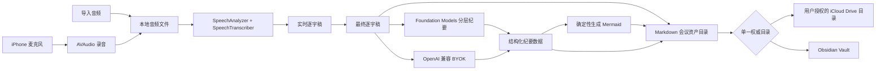

# Quillvault（墨匣）项目说明书

> 版本：v2.0
> 更新日期：2026-07-30
> 状态：核心技术路线已验证，MVP 设计文档待确认
> 文档定位：Quillvault v1 的产品、技术与验证单一事实源
> 配套文档：[领域词汇](../CONTEXT.md) · [iOS 手机端竞品分析](./Quillvault_iOS手机端竞品分析_2026-07-28.md) · [技术决策](./adr/0001-ios26与双纪要模式.md) · [Demo 技术验证结论](./demo/真机技术闭环Demo_技术验证结论.md) · [MVP 设计文档](./MVP_设计文档索引.md)

---

## 1. 项目结论

### 1.1 一句话定位

Quillvault 是一款面向 iPhone 的本地优先会议纪要 App：一键记录面对面会议，在设备端实时转写，生成带可编辑 Mermaid 图示的结构化纪要，并将录音、逐字稿和 Markdown 文件直接保存到用户自己的 iCloud 或 Obsidian 目录。

英文 tagline：`Your meetings, drawn in private.`

中文 tagline：`会画图的隐私会议纪要。`

### 1.2 是否值得做

**有条件 GO。**

这个市场已有成熟产品，飞书妙记在纪要产物上也是重要标杆。Quillvault 的机会不是做出另一个功能相似的“AI 转写 App”，而是把以下能力组合成一个完整、可信的 iPhone 工作流：

> 一键面对面记录 + 本地实时转写 + 飞书式结构化纪要 + 可编辑图示 + BYOK + Markdown 文件主权 + iCloud/Obsidian + 绝对零遥测 + 一次性付费。

竞品已经分别验证了本地转写、BYOK、Obsidian、智能纪要和可视化需求，但目前没有发现一款 iPhone App 明确提供上述完整组合。详细证据见[竞品分析](./Quillvault_iOS手机端竞品分析_2026-07-28.md)。

### 1.3 项目目标

本项目是能力/期权型项目：

1. 在可控投入内完成一款可上架、可收费的原生 iOS 产品；
2. 验证 PKM 技术用户是否愿意为“会议资产 + 可编辑图示 + 文件主权”迁移和付费；
3. 沉淀 SpeechAnalyzer、端侧模型、BYOK、Markdown 文件工作流和 StoreKit 能力；
4. 收入是结果，不是继续投入的先决条件。

完整功能开发控制在 6–8 周，但排期从技术可行性闸门通过后开始计算。

---

## 2. 用户与场景

### 2.1 唯一核心用户

首发只服务 PKM 技术用户：

- 使用 iPhone；
- 使用 Obsidian 或 Markdown；
- 能够理解并配置 API Key；
- 重视隐私、可迁移性和文件长期可读；
- 需要记录面对面会议、讨论或访谈。

咨询师、独立研究者、自由职业者和开发者都可能属于这个群体，但 v1 不为普通大众或企业采购场景增加专用能力。

### 2.2 核心使用场景

典型流程是：

1. 用户进入会议；
2. 从首页点击一次主按钮，或按下已配置的 iPhone Action Button；
3. Quillvault 立即录音并显示实时逐字稿；
4. 会议结束后自动补齐最终逐字稿；
5. 用户选择设备端 AI 或 BYOK 生成结构化纪要；
6. App 生成核心观点图和必要的章节图；
7. 会议资产直接写入用户的权威目录。

### 2.3 明确区分在线会议软件

Quillvault 处理的是同一物理空间内、由 iPhone 麦克风采集的面对面会话，也支持导入单个已有音频文件。

v1 不提供：

- 会议机器人；
- 日历自动入会；
- Zoom、Teams、Meet 集成；
- 其他 App 或通话的系统音频捕获；
- 团队空间、账号或在线协作。

它不与 Otter、Fireflies、Fathom 等在线会议 SaaS 正面竞争。

---

## 3. 核心价值主张

### 3.1 一键得到可长期使用的会议资产

Quillvault 的产品单元不是“一段 AI 摘要”，而是一次会议对应的一组真实文件：

- 原始录音；
- 可按时间回溯的完整逐字稿；
- 结构化 Markdown 纪要；
- 可编辑、可被 Obsidian 和 AI 继续读取的 Mermaid 图示。

### 3.2 隐私边界清晰

设备端模式：

- 音频、逐字稿、纪要和图示均在设备端处理；
- 数据不会发送给 Quillvault 或第三方 AI 服务。

BYOK 模式：

- 音频始终不上传；
- 只有用户主动生成纪要时，逐字稿文本才直达用户配置的 AI 服务商；
- 请求不经过 Quillvault 服务器。

所有模式共同遵守：

- 无 Quillvault 账号；
- 无自建服务端；
- 无统计 SDK；
- 无崩溃上报 SDK；
- 无遥测、无采集、无广告；
- 除 iCloud 和用户主动 BYOK 外，不产生业务网络请求。

因此，产品不能笼统宣传“任何数据永不离开设备”，应准确表达两种模式的数据流。

### 3.3 Markdown 是内容真相

Markdown 不是导出格式，而是应用真正读写的内容源。App 内数据库只能保存可从文件重建的本地索引，不得成为不可迁移的私有内容库。

用户可以绕过 Quillvault，直接通过 Obsidian、Files、Git、Claude、Codex 或其他工具读取和编辑会议文件。

### 3.4 图示不是装饰

每份纪要至少生成一张核心观点图，用于表达整场会议最重要的观点与关系。

适合用流程、时序、分支或多观点关系表达的章节，可以在对应段落附加章节图；每份纪要最多 3 张章节图。图示必须比普通文字列表提供更多结构信息，不能机械地把每段文字改画成框。

---

## 4. v1 产品范围

### 4.1 必须完成

- 首页一键开始面对面会议；
- 用户配置 Action Button 后快速启动；
- 锁屏和切换 App 后持续可靠录音；
- SpeechAnalyzer 设备端实时转写；
- 临时结果与最终结果的实时 UI；
- 后台分析暂停后的逐字稿自动追平；
- 导入单个音频文件；
- 设备端智能纪要；
- OpenAI 兼容 BYOK 纪要；
- 完整逐字稿与结构化纪要；
- 核心观点图与按需章节图；
- Markdown 会议资产目录；
- 用户通过系统文件夹选择器授权外部权威目录；
- 权威目录可位于 iCloud Drive、Obsidian Vault、本机或其他 Files Provider；
- 原始录音保留设置；
- StoreKit 一次性永久解锁；
- 简体中文和英语完整 QA；
- 绝对隐私边界与录音状态提示。

### 4.2 明确不做

- 自动说话人区分、声纹或真实姓名映射；
- 使用“说话人 1/2”伪装身份识别；
- Siri、锁屏组件或 Apple Watch 启动入口；
- 在线会议机器人或系统音频捕获；
- 视频、相册音轨、批量导入或分享扩展；
- 知识问答、跨会议搜索或向量数据库；
- 行业纪要模板；
- 团队协作、账号系统或后端；
- 双向文件同步、镜像副本或冲突合并；
- 图片生成；
- 订阅、按分钟收费或服务端推理补贴；
- iOS 17–25 的 SFSpeechRecognizer 长音频回退；
- 第二套内置本地大模型；
- 混合语言识别或会议中自动切换语言。

### 4.3 语言策略

技术实现不维护静态语言白名单，而是在运行时读取：

- `SpeechTranscriber.supportedLocales`；
- `SpeechTranscriber.installedLocales`。

系统支持但未安装的语言可以引导用户下载模型。v1 对简体中文和英语完成完整测试并作出质量承诺；其他设备可用语言作为实验性能力展示。

---

## 5. 纪要产物

### 5.1 固定结构

每份结构化纪要包含：

1. **会议总览**：主题、时间、时长、语言和一句话结论；
2. **核心摘要**：会议背景、讨论结果与重要信息；
3. **主题章节**：按话题组织，带时间范围；
4. **关键决策**：结论、原因和原文依据；
5. **行动项**：事项、负责人、截止时间和原文依据；
6. **风险与未决问题**；
7. **核心观点图**：每份纪要必须生成；
8. **章节图**：必要时生成，最多 3 张；
9. **来源链接**：跳转到完整逐字稿和录音。

知识问答、跨会议检索和行业模板不属于 v1 的“飞书式纪要”定义。

### 5.2 负责人规则

v1 不做说话人分离。只有当原文明确出现姓名与责任关系时，AI 才能填写负责人；否则统一标记为“待确认负责人”。

不能根据音色、发言顺序或上下文猜测真实身份。错误归责比没有归责更危险。

### 5.3 图示类型

App 根据内容场景选择受支持的 Mermaid 类型：

| 内容结构 | 图示类型 |
|---|---|
| 决策、流程、依赖、分支 | `flowchart` |
| 事件经过、阶段和里程碑 | `timeline` |
| 多方交互、调用或沟通顺序 | `sequenceDiagram` |
| 主题拆解、观点发散 | `mindmap` |

AI 不直接输出任意 Mermaid 源码，而是生成受约束的节点、关系和图类型。App 校验结构后确定性生成 Mermaid，以减少语法错误和提示词注入风险。用户可以直接编辑最终 Mermaid 代码。

---

## 6. 文件与存储

### 6.1 会议资产目录

```text
2026-07-28-产品讨论/
├── minutes.md
├── transcript.md
└── recording.m4a
```

- `minutes.md`：YAML Front Matter、结构化纪要、内嵌 Mermaid 和相对来源链接；
- `transcript.md`：按时间戳分段的完整逐字稿；
- `recording.m4a`：原始录音，按用户设置决定是否保留。

建议的 Front Matter：

```yaml
---
title: 产品讨论
started_at: 2026-07-28T14:00:00+08:00
duration_seconds: 3600
language: zh-Hans
summary_mode: on-device
provider: apple-foundation-models
model: system-default
tags: [meeting]
---
```

### 6.2 单一权威目录

MVP 首次使用时，用户必须通过系统文件夹选择器授权一个外部目录；该目录直接成为唯一内容源，而不是接收导出副本。MVP 不创建应用自有默认 iCloud 容器；该能力留待后续版本评估。

- 所选目录位于普通 iCloud Drive：获得系统 iCloud 同步；
- Vault 位于 iCloud Drive：同时获得 Obsidian 使用与 iCloud 同步；
- Vault 位于本机或其他文件服务：同步能力由该位置决定；
- Quillvault 不维护第二份镜像；
- v1 不做双向同步和冲突合并。

技术上使用安全作用域目录 URL、持久书签与文件协调器；权限被撤销或书签失效时，停止写入并明确要求用户重新选择目录。

### 6.3 原始录音设置

设置项名称：`纪要生成后保留原始录音`。

- 默认开启；
- 关闭后，仅在逐字稿与纪要均成功写入权威目录后删除录音；
- 处理中、生成失败或文件写入失败时不得删除；
- 用户可以在单场会议中手动删除录音，不影响 Markdown 文件。

---

## 7. 技术方案

### 7.1 架构



### 7.2 实时录音与转写

- 最低系统：iOS 26；
- 音频：`AVAudioSession` + `AVAudioEngine` 或等价可靠录音管线；
- 转写：`SpeechAnalyzer` + `SpeechTranscriber`；
- UI：浅色显示 volatile result，final result 到达后替换；
- 每个结果保存音频时间范围，支持从逐字稿回跳录音；
- 模型资源通过 `AssetInventory` 检查、下载与管理；
- 不满足 `SpeechTranscriber.isAvailable` 或目标 locale 不受支持时，不允许虚假进入实时转写。

Apple 明确将 SpeechTranscriber 定位于设备端、长音频、远距离声音、会议和实时低延迟场景，并支持预录音频分析。[官方说明](https://developer.apple.com/videos/play/wwdc2025/277/)

### 7.3 后台与中断

发布硬门槛是后台录音不中断，而不是后台持续显示转写。

- 锁屏或切换 App 后继续保存原始音频；
- 如果系统允许，继续投喂 SpeechAnalyzer；
- 如果系统暂停分析，记录最后完成的音频时间码；
- 恢复前台或停止会议后，从原始录音补齐缺失区间；
- 正确处理电话、其他音频会话、路线变化和存储不足；
- 任何情况下都不能因为转写失败丢失已录音频。

Apple 官方没有对 SpeechAnalyzer 锁屏后台持续执行作出明确保证，因此必须通过真机 Spike 验证，并保留补齐路径。

### 7.4 快速开始与 Action Button

首页主按钮点击一次即进入记录界面并启动录音。

通过 App Intents 暴露 App Shortcut，用户可以在系统设置中绑定到 Action Button。稳妥边界是由快捷操作唤起 App，再在麦克风已授权的前提下立即启动；v1 不承诺 App 完全未唤起时静默在后台打开麦克风。

Apple 明确支持将 App Shortcut 分配给受支持 iPhone 的 Action Button。[官方说明](https://developer.apple.com/documentation/appintents/hardware-interactions)

### 7.5 设备端纪要

在 `SystemLanguageModel.default.availability == .available` 时，默认使用 Foundation Models。

Apple 端侧模型单个 session 的上下文窗口为 4,096 token；中文约为一字一 token，长会议不能整篇一次输入。[官方说明](https://developer.apple.com/documentation/technotes/tn3193-managing-the-on-device-foundation-model-s-context-window)

处理管线：

1. 按时间、主题边界和 token 数切分逐字稿；
2. 每个分块使用独立 session 生成章节摘要、决策、待办和证据；
3. 递归合并分块结果；
4. 生成最终结构化纪要；
5. 单独生成受约束的图数据；
6. App 生成并校验 Mermaid。

所有结构化输出优先使用 guided generation / `Generable` 类型。模型不可用时，清晰引导用户配置 BYOK，不静默上传或降级到 Quillvault 服务。

### 7.6 BYOK

v1 只实现 OpenAI 兼容协议：

- Base URL；
- Model；
- API Key；
- 连接测试。

API Key 只存于 Keychain。调用前必须显示目标域名、服务商和“仅发送逐字稿文本”的说明；用户可取消。

不单独维护 Anthropic、Gemini 等非兼容适配器。OpenAI、OpenRouter、自托管或其他兼容服务使用同一接口，但结构化输出能力必须在连接测试中验证。

### 7.7 Mermaid 渲染

- 将 Mermaid 源码保存在 `minutes.md` 中；
- 使用随 App 打包的 Mermaid 渲染资源在本地 WKWebView 中展示；
- 禁止加载远程脚本、字体、图片或遥测；
- 设置内容安全策略并关闭不需要的导航；
- Mermaid 解析失败时保留源码、显示可诊断错误，不丢失纪要；
- 渲染类型限定为 v1 已验证的四类。

选择内置 Mermaid 运行时，是为了同时支持 flowchart、timeline、sequenceDiagram 和 mindmap；不再依赖只覆盖部分语法的原生渲染库。

---

## 8. 商业模式

### 8.1 购买路径

- 免费下载；
- 完整体验 3 场会议；
- 每场试用最多 15 分钟；
- 之后通过 StoreKit 2 非消耗型内购永久解锁；
- 首发价：¥38 / US$4.99；
- 不提供订阅；
- BYOK 推理费用由用户直接支付服务商；
- 已购买用户永久保留已解锁能力。

### 8.2 用户为何付费

付费理由不是“获得本地转写”，因为 Apple Notes 和免费竞品已经提供类似能力。真正的付费对象是完整工作流：

- 一键开始；
- 飞书式可溯源纪要；
- 可编辑 Mermaid；
- Markdown 文件主权；
- iCloud/Obsidian 直接存储；
- BYOK；
- 绝对零遥测；
- 无订阅。

---

## 9. 隐私、合规与信任

### 9.1 产品内必须可见

- 首次录音前请求麦克风权限；
- 明确提醒用户遵守所在地录音与告知规则；
- 录音过程中持续显示醒目的录音状态；
- BYOK 首次及目标服务商变化时重新披露数据去向；
- 设置页提供可读的隐私数据流；
- 权威目录和当前总结模式在会议详情中可见。

### 9.2 可验证隐私标准

- App Store 隐私标签申报“不收集数据”必须与实现一致；
- 发布包不得包含统计、广告或第三方崩溃上报 SDK；
- 网络检查只能看到 iCloud 系统流量和用户主动 BYOK 的目标域名；
- Mermaid 渲染断网可用；
- 禁止以“匿名”“改善体验”为由加入遥测。

### 9.3 主要风险

| 风险 | 应对 |
|---|---|
| BYOK 与“完全本地”宣传冲突 | 明确区分设备端模式和 BYOK 模式 |
| 用户未征得录音同意 | 首次使用和录音界面持续提示，隐私政策明确责任 |
| 错误识别负责人 | 不做身份猜测，无明确证据时标记待确认 |
| Mermaid 错误或误导 | 结构化数据驱动、语法校验、保留源码与原文依据 |
| 权威目录权限被撤销 | 写前检查、停止生成、要求重新授权，绝不回落到隐藏副本 |
| iCloud 文件冲突 | 单一权威目录、文件协调、原子写入，不做双向镜像 |
| Apple Notes 或 Synopsule 跟进 | 深化文件格式、可编辑图示和可溯源资产，而非堆功能 |
| App Review 原创性 | 独立信息架构、品牌、视觉和交互，不复制飞书或竞品 UI |

---

## 10. 技术可行性闸门

完整开发前先执行 5 天真机 Spike。以下是进入 6–8 周开发的必要条件：

| 验证项 | 通过标准 |
|---|---|
| Action Button | 已授权设备冷启动后可靠进入录音，目标 2 秒内 |
| 长会录音 | 简体中文面对面会议连续录制 60 分钟，锁屏与切 App 后无音频丢失 |
| 转写追平 | 后台分析被暂停后，恢复或结束时能从录音补齐，时间轴无重复和空洞 |
| 语言资源 | 简体中文与英语 locale 可检查、下载并稳定转写 |
| 长文纪要 | 30–60 分钟中文逐字稿可分层生成完整结构化纪要 |
| 图示 | 必有核心观点图，章节图按需生成；四类 Mermaid 均可离线渲染 |
| 文件主权 | App 重启后仍可写入已选择的 iCloud/Obsidian 权威目录 |
| 故障安全 | 纪要、转写或写入失败时不删除原始录音 |

任何核心项失败：

1. 先判断是系统限制、实现问题还是质量不达标；
2. 调整范围或技术路线；
3. 重新验证；
4. 不以“后续优化”为由直接进入完整开发。

---

## 11. 开发计划

### 阶段 0：技术闸门（5 天）

完成第 10 节全部 Spike，并形成可复用验证样本和结论。

### 阶段 1：记录闭环（第 1–2 周）

- SwiftUI 首页与记录界面；
- AVAudio 录音与中断恢复；
- SpeechAnalyzer 实时转写；
- Action Button App Shortcut；
- 音频导入；
- Markdown 资产目录。

验收：真实会议可从一键开始到产生录音和逐字稿，锁屏不丢音频。

### 阶段 2：纪要与图示（第 3–4 周）

- Foundation Models 分层纪要；
- OpenAI 兼容 BYOK；
- 固定纪要结构；
- 图类型选择与确定性 Mermaid；
- 本地渲染与编辑。

验收：30–60 分钟中英文会议可生成完整、可溯源且可渲染的纪要。

### 阶段 3：文件主权与付费（第 5–6 周）

- 外部权威目录选择与持久授权；
- iCloud Drive、Obsidian 与其他 Files Provider 协调；
- 文件协调、原子写入和错误恢复；
- 录音保留设置；
- StoreKit 试用与永久解锁；
- 隐私披露。

验收：删除本地索引后仍能从 Markdown 文件重建列表，重启后可继续写入。

### 阶段 4：验证与发布（第 7–8 周）

- 真实会议回归；
- 断网与中断测试；
- 隐私网络审计；
- App Review 原创性与元数据检查；
- TestFlight 外部测试；
- 根据阻断问题修复，不新增范围。

---

## 12. 验收标准

v1 进入 TestFlight 前必须满足：

- 首页与 Action Button 均可启动会议；
- 60 分钟锁屏会议无音频丢失；
- 最终逐字稿可覆盖完整音频时间轴；
- 中英文实时转写和导入音频均可工作；
- 每份纪要具有固定结构、原文依据和至少一张核心观点图；
- 单份纪要章节图不超过 3 张；
- Mermaid 源码可编辑，断网可渲染；
- Markdown 是可直接读取的内容真相；
- iCloud 或 Obsidian 权威目录在重启后保持有效；
- 关闭录音保留时，仅在两个 Markdown 文件成功落盘后删除音频；
- 设备端模式无业务网络请求；
- BYOK 只向用户配置的目标发送逐字稿文本；
- 无统计、广告或第三方崩溃 SDK；
- 购买与恢复购买可用；
- 没有导致录音或 Markdown 丢失的已知缺陷。

---

## 13. 四周市场验证

TestFlight 发布后四周内，通过主动反馈、访谈记录和实际购买结果核验：

- 招募 15 位 PKM 技术用户；
- 至少 10 位用于一次真实面对面会议；
- 至少 6 位累计使用 3 次以上；
- 至少 5 位将会议资产保留在 Obsidian 或 iCloud 中继续使用；
- 至少 3 位完成 ¥38 永久解锁。

同时重点访谈：

- 是否愿意用它替代 Voice Memos + 手动粘贴 AI；
- 结构化纪要是否真的减少会后整理时间；
- 核心观点图和章节图是否被打开、修改或复用；
- Markdown 是否是购买理由，而不只是“可导出”；
- 用户最信任的是本地模式、BYOK，还是两者可选。

未达到门槛时，先定位问题属于录音可靠性、转写质量、纪要质量、文件工作流还是场景需求，不直接增加功能。

---

## 14. 最终产品原则

1. **录音可靠性高于 AI 速度**：可以稍后补齐转写，不能丢失录音。
2. **原文依据高于摘要自信**：无法确认的负责人和结论必须明确标记。
3. **文件主权高于 App 锁定**：用户删除 Quillvault 后，会议文件仍然可读可用。
4. **准确隐私高于营销口号**：BYOK 会发送文本，就必须清楚说明。
5. **结构化图示高于装饰图片**：图必须表达关系，并保留可编辑源码。
6. **范围收敛高于功能齐全**：遇到时间压力先砍非核心，不扩到在线会议和团队协作。
7. **真实使用高于下载数字**：是否进入用户的会议与知识工作流，决定项目是否继续。

---

*本说明书取代 v1.0。产品词汇以 `CONTEXT.md` 为准；涉及 iOS 26、双纪要模式和长会议分层处理的技术选择以 ADR 为准。任何范围变化都必须同步更新三处文档。*
